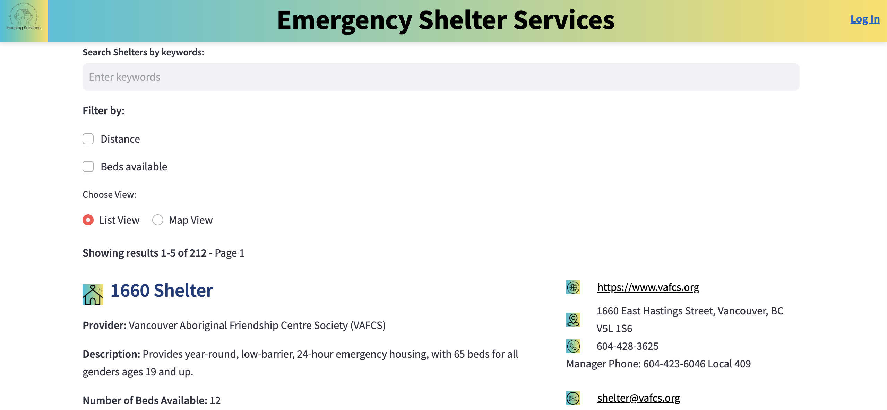
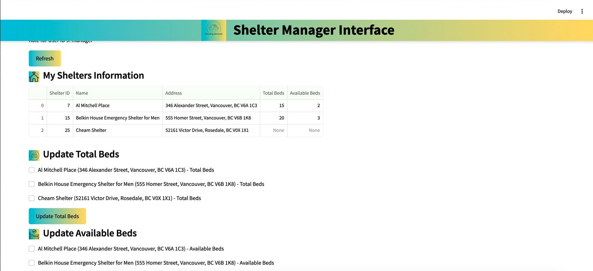

# Shelter Bed Availability Platform

This project is a web-based platform designed to enhance accessibility to shelter beds for those in need and streamline shelter management processes. The platform provides real-time updates on bed availability for public users and tools for shelter managers to efficiently manage and track availability.

---

## Features

- **Real-Time Bed Availability**  
  Public users can search for available shelter beds when they need them.  

- **Shelter Manager Tools**  
  Managers can update and track bed availability, ensuring smooth operations.  

- **User-Friendly Interface**  
  Designed for accessibility and ease of use for both public users and shelter staff.  

---

## Technologies Used

- **Backend**: PostgreSQL, Python, Streamlit  
- **Frontend**: Streamlit
- **Database**: PostgreSQL  
- **Tools**: Docker (for deployment)  

---
## Screenshot

- Search function by keywords (with fuzzymatching 80% to cover the case when the word is not exactly match because people forget the name, typo, etc...)
- Search filter by distance to where user is at, and by number of bed required
- Real time update with key information of the shelters for easy and faster contact

- Authorized Managers can access and edit bed availability and shelter information
- Real time update to front end interface

---
## Contributors

- [Huan LV](https://github.com/huanlv-git) - Project Lead  
- [Anthony Nguyen](https://github.com/realanguyen96) - Backend Feature Development  / Bug Fixes
- [Andy Nguyen](https://github.com/another-contributor) - Frontend Feature Development  / Design
- [Dawn Dang](https://github.com/contributor-username) - Frontend Feature Development  / Design
- [Divyanshu Fialok](https://github.com/another-contributor) - Backend Feature Development  / Bug Fixes

